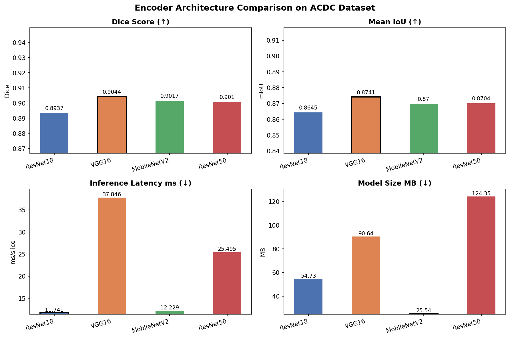
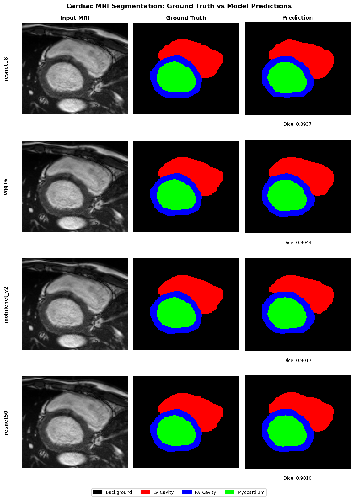

# ACDC Cardiac MRI Segmentation: Encoder Comparison

Code for our paper comparing four U-Net encoder backbones (ResNet18, VGG16,
MobileNetV2, ResNet50) on 2D cardiac MRI segmentation, using the
[ACDC dataset](https://www.creatis.insa-lyon.fr/Challenge/acdc/) (MICCAI
2017 Automated Cardiac Diagnosis Challenge). We compare segmentation
accuracy (Dice, mIoU) against inference latency and model size, since the
right architecture for a paper isn't always the right architecture for deployment.

## Results

| Encoder | Dice | mIoU | Latency (ms/slice) | Model size (MB) |
|---|---|---|---|---|
| ResNet18 | 0.8937 | 0.8645 | 11.74 ± 0.32 | 54.73 |
| VGG16 | 0.9044 | 0.8741 | 37.85 ± 0.49 | 90.64 |
| MobileNetV2 | 0.9017 | 0.8700 | 12.23 ± 0.31 | 25.54 |
| ResNet50 | 0.9010 | 0.8704 | 25.50 ± 0.39 | 124.35 |

*Latency is single-image (batch size 1) inference time on GPU, mean over
100 timed runs after 20 warm-up iterations. See
[`results/all_results.json`](results/all_results.json) for the full
numbers, including batch-8 throughput and per-class Dice
([`results/per_class_dice.json`](results/per_class_dice.json)).*




## Repo structure

```
.
├── src/                   # importable package -- the actual model/data/loss code
│   ├── dataset.py         #   ACDC loading + preprocessing + Lightning DataModule
│   ├── model.py           #   U-Net wrapper (segmentation-models-pytorch) + LightningModule
│   ├── losses.py          #   Dice/CE loss, Dice score, per-class Dice
│   ├── benchmark.py       #   latency timing, results.json read/write
│   └── visualize.py       #   comparison grid + metrics bar chart plotting
├── notebooks/
│   ├── 01_train.ipynb     # trains all 4 encoders, saves checkpoints + results/all_results.json
│   └── 02_evaluate.ipynb  # per-slice latency, per-class Dice, figures
├── configs/
│   └── default.yaml       # encoder list, training hyperparameters
├── checkpoints/           # trained weights (not committed -- see checkpoints/README.md)
├── results/
│   ├── all_results.json   # single source of truth for every number in the paper/README
│   └── per_class_dice.json
└── figures/               # generated PNGs (segmentation grid, metrics bar chart)
```

**Design note:** both notebooks import the same code from `src/` instead of
redefining the dataset/model/loss classes independently. Every table and
figure is generated by reading `results/all_results.json` -- nothing is
hardcoded into a notebook cell.

## Setup

```bash
pip install -r requirements.txt
```

Requires a CUDA GPU for training and the latency benchmarks in
`02_evaluate.ipynb` (the numbers above were measured on
GPU and won't match on CPU).

## Reproducing the results

1. **Train**: open `notebooks/01_train.ipynb` and run all cells. It
   downloads the ACDC dataset via `kagglehub`, trains all four encoders
   with early stopping, and writes checkpoints to `checkpoints/` and
   metrics to `results/all_results.json`.
2. **Evaluate**: open `notebooks/02_evaluate.ipynb` and run all cells. It
   loads the checkpoints, measures per-slice latency, computes per-class
   Dice, and regenerates both figures in `figures/`.

If you only want the figures/tables and already have the checkpoints (see
`checkpoints/README.md`), you can skip straight to step 2.

## Dataset

[ACDC (Automated Cardiac Diagnosis Challenge)](https://www.creatis.insa-lyon.fr/Challenge/acdc/),
downloaded automatically via `kagglehub` from
[`samdazel/automated-cardiac-diagnosis-challenge-miccai17`](https://www.kaggle.com/datasets/samdazel/automated-cardiac-diagnosis-challenge-miccai17).
100 patients across 5 pathology groups (NOR, MINF, DCM, HCM, RV); we use
the end-diastolic (ED) and end-systolic (ES) frames and their ground-truth
segmentations (background, LV cavity, RV cavity, myocardium). Splits are
70/15/15 train/val/test, stratified by pathology group, at the patient
level (no slices from the same patient appear in more than one split).


## License

See [LICENSE](LICENSE).
