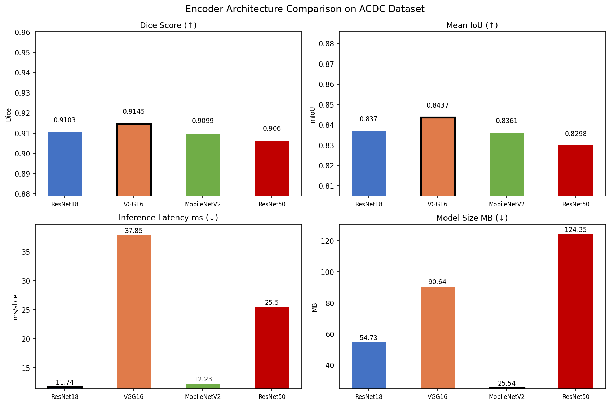
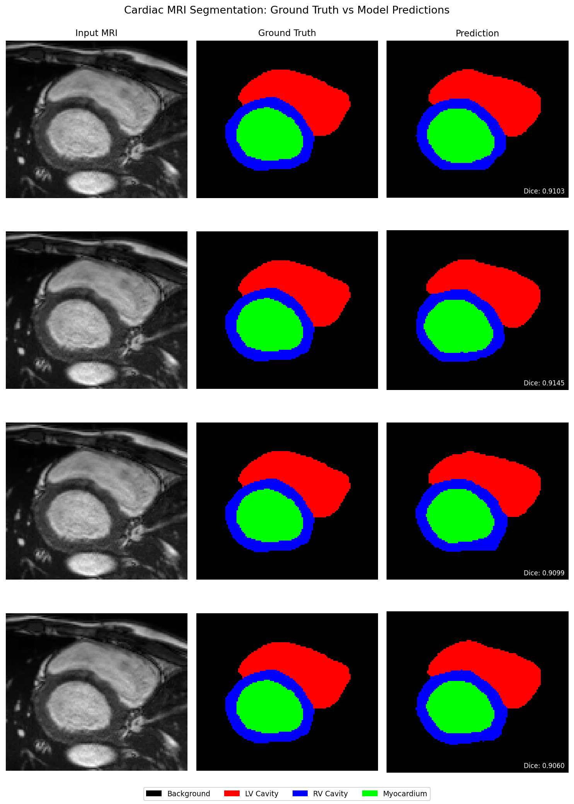

# ACDC Cardiac MRI Segmentation: Encoder Comparison

Code for our paper comparing four U-Net encoder backbones (ResNet18, VGG16, MobileNetV2, ResNet50) on 2D cardiac MRI segmentation, using the [ACDC dataset](https://www.creatis.insa-lyon.fr/Challenge/acdc/) (MICCAI 2017 Automated Cardiac Diagnosis Challenge). We compare segmentation accuracy (Dice, mIoU) against inference latency and model size, since the right architecture for a paper isn't always the right architecture for deployment.

## Results
<div align="center">

| Encoder | Dice | Latency (ms/slice) | Model size (MB) | Params M | GMACs |
| :---: | :---: | :---: | :---: | :---: | :---: |
| ResNet18 | 0.9103 ± 0.0051 | 11.74 ± 0.32 | 54.73 | 14.32 | 21.30 |
| VGG16 | 0.9145 ± 0.0013 | 37.85 ± 0.49 | 90.64| 23.75 | 98.82 |
| MobileNetV2 | 0.9099 ± 0.0046 | 12.23 ± 0.31 | 25.54| 6.63 | 13.46 |
| ResNet50 | 0.9060 ± 0.0053 | 25.50 ± 0.39 | 124.35 | 32.52 | 42.23 |

</div>

*Latency is single-image (batch size 1) inference time on GPU, mean over 100 timed runs after 20 warm-up iterations. Our chosen deployment model, MobileNetV2, was additionally evaluated for CPU inference, achieving a latency of 375.61 ± 11.48  ms/slice. See [`results/all_results.json`](results/all_results.json) for the full numbers, including batch-8 throughput and per-class Dice ([`results/per_class_dice.json`](results/per_class_dice.json)).*




## Repo structure

```
.
├── src/                   
├── notebooks/
│   ├── 01_train_part1.ipynb   # Contains code to train all seeds (0, 42, 11), but times out on Kaggle after seeds 0 & 42
│   ├── 02_train_part2.ipynb   # Resumes training for the final seed (11)
│   └── 03_compile_and_evaluate.ipynb  # Compiles all multi-seed checkpoints, tests CPU/GPU latency, generates figures
├── configs/               
├── checkpoints/           
├── results/
│   ├── all_results.json   
│   └── per_class_dice.json
└── figures/
```

**Design note:** all notebooks import the same code from `src/` instead of redefining the dataset/model/loss classes independently. Every table and figure is generated by reading `results/all_results.json` -- nothing is hardcoded into a notebook cell.

## Setup

```bash
pip install -r requirements.txt
```

Requires a CUDA GPU for training and for the GPU latency benchmarks in `03_compile_and_evaluate.ipynb`. The notebook also contains cells specifically for measuring CPU latency, which should be run on a CPU instance (or with PyTorch set to CPU mode).

## Reproducing the results

1. **Train**: Run `notebooks/01_train_part1.ipynb`. Due to Kaggle's 12-hour GPU time limit, this will likely only finish training for seeds 0 and 42 before timing out. Run `notebooks/02_train_part2.ipynb` to finish training the remaining models for seed 11.
2. **Evaluate**: Run `notebooks/03_compile_and_evaluate.ipynb`. It loads the checkpoints across all 3 seeds (0, 42, 11), evaluates performance to get the average metrics, measures CPU and GPU latency, and regenerates the figures.

If you only want the figures/tables and already have the checkpoints (see `checkpoints/README.md`), you can skip straight to step 2.

## Dataset

[ACDC (Automated Cardiac Diagnosis Challenge)](https://www.creatis.insa-lyon.fr/Challenge/acdc/), downloaded automatically via `kagglehub` from [`samdazel/automated-cardiac-diagnosis-challenge-miccai17`](https://www.kaggle.com/datasets/samdazel/automated-cardiac-diagnosis-challenge-miccai17). 100 patients across 5 pathology groups (NOR, MINF, DCM, HCM, RV); we use the end-diastolic (ED) and end-systolic (ES) frames and their ground-truth segmentations (background, LV cavity, RV cavity, myocardium). Splits are 70/15/15 train/val/test, stratified by pathology group, at the patient level (no slices from the same patient appear in more than one split).


## License

See [LICENSE](LICENSE).
